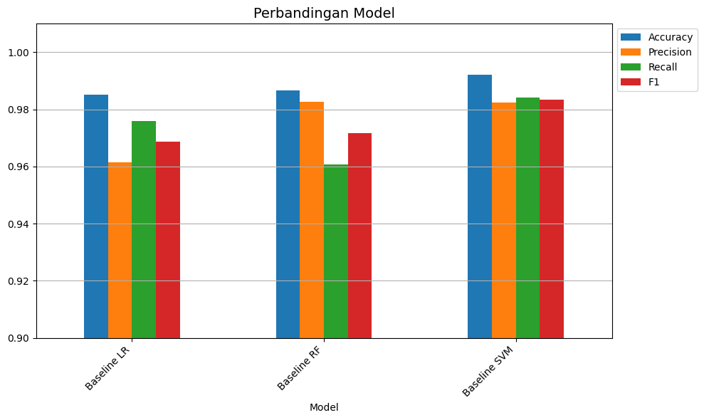

# judol-comment-classification
Machine learning-based text classification system for detecting and filtering YouTube comments that promote online gambling. This project compares Logistic Regression, Random Forest, and Support Vector Machine to identify the most effective model and implements a preventive comment moderation simulation.

# Demo
Watch the demo: https://youtu.be/RfaJTMXTPA0?si=Kf3twQtkLj6y0aRJ
