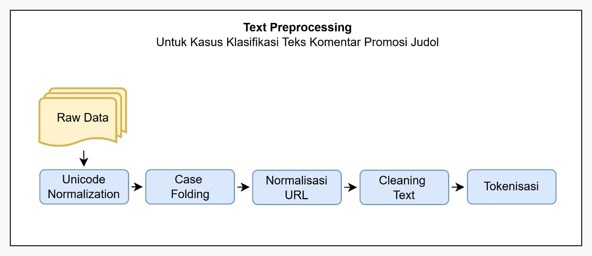

# Dataset Documentation
## Daftar File

### Dataset Files

#### 1. `dataset_judol_clean.csv`
**Deskripsi:** Dataset YouTube comments yang sudah dibersihkan (cleaned).

**Kolom:**
- `comment_id`: ID unik komentar dari YouTube
- `author`: Username/channel dari pembuat komentar
- `comment_text_clean`: Teks komentar yang sudah dibersihkan dan di-preprocess
- `label`: Label klasifikasi (0 atau 1)
  - `0`: Bukan konten perjudian (non-judol)
  - `1`: Konten perjudian (judol)

**Kegunaan:** Digunakan untuk training model klasifikasi karena teksnya sudah dibersihkan dari noise dan karakter aneh.

---

#### 2. `dataset_judol_labelled.csv`
**Deskripsi:** Dataset YouTube comments dengan label, tetapi teks masih dalam bentuk original (tidak dibersihkan sepenuhnya).

**Kolom:**
- `comment_id`: ID unik komentar dari YouTube
- `author`: Username/channel dari pembuat komentar
- `comment_text`: Teks komentar dalam bentuk original
- `label`: Label klasifikasi (0 atau 1)

**Kegunaan:** Dapat digunakan untuk analisis atau sebagai referensi data original sebelum cleaning. Berguna untuk memahami jenis-jenis obfuscation yang digunakan dalam konten perjudian.

---

#### 3. `situs_judol.csv`
**Deskripsi:** Daftar nama situs perjudian online yang digunakan dalam penelitian.

**Kolom:**
- `site`: Nama domain situs perjudian

**Contoh isi:** 121rojer, 123full, 123vegas, 5unsur, tkp62 dll.

**Kegunaan:** Referensi untuk mengidentifikasi mention situs perjudian dalam komentar YouTube atau untuk validasi data.

---

#### 4. `youtube_links.csv`
**Deskripsi:** Daftar link video YouTube yang digunakan sebagai sumber data komentar.

**Kolom:**
- `No`: Nomor urut
- `Link`: URL video YouTube

**Format:** YouTube Shorts dan regular YouTube links

**Kegunaan:** Referensi video mana saja yang di-scrape untuk mengumpulkan dataset komentar.

---

#### 5. `obfuscation_mapping.json`
**Deskripsi:** Mapping untuk transformasi karakter-karakter obfuscated menjadi karakter normal.

**Isi:** Dictionary yang memetakan karakter unicode khusus, emoji, dan karakter styled (seperti karakter bold, subscript, dll.) ke karakter ASCII normal.

**Contoh:**
```json
{
  "𝟘": "0",      // Mathematical Alphanumeric Symbols
  "0⃣": "0",     // Keycap digit emoji
  "1️⃣": "1",     // Emoji variations
  "①": "1",      // Enclosed numerals
  "【0】": "0"   // Full-width brackets
}
```

**Kegunaan:** Digunakan dalam preprocessing data untuk menormalkan teks yang menggunakan karakter obfuscated (teknik untuk mengelak filter atau moderation).

---

#### 6. `scrape-youtube-apiv3.ipynb`
**Deskripsi:** Jupyter Notebook untuk scraping YouTube comments menggunakan YouTube API v3.

**Fungsi Utama:**
- Mengakses YouTube API untuk mengambil comments dari video tertentu
- Melakukan filtering berdasarkan kriteria tertentu
- Menyimpan hasil scrape ke file CSV
- Melakukan preprocessing awal pada data yang di-scrape

**Requirements:**
- YouTube API Key
- google-api-python-client library
- Autentikasi dengan Google Cloud

**Kegunaan:** Untuk mengumpulkan dataset komentar baru dari video YouTube atau memperbarui dataset yang sudah ada.

---

## Struktur Data

### Label Definition
- **Label 0**: Komentar yang BUKAN tentang perjudian/judol
- **Label 1**: Komentar yang berisi referensi perjudian, situs judol, atau konten terkait perjudian

### Data Preprocessing Flow



---

## Cara Menggunakan Dataset

### 1. Untuk Training Model
```python
import pandas as pd

# Load cleaned dataset
df = pd.read_csv('dataset_judol_clean.csv')

# Split features and labels
X = df['comment_text_clean']
y = df['label']

# Proceed dengan model training...
```

### 2. Untuk Analisis
```python
import pandas as pd

# Load labelled dataset
df = pd.read_csv('dataset_judol_labelled.csv')

# Analisis distribusi label
print(df['label'].value_counts())

# Analisis panjang teks
print(df['comment_text'].str.len().describe())

# dan lain-lain...
```

### 3. Untuk Scraping Data Baru
Buka notebook `scrape-youtube-apiv3.ipynb` dan ikuti instruksi untuk:
- Setup YouTube API Key (aktifkan YouTube Data API v3 di Google Cloud Console https://console.cloud.google.com/marketplace/product/google/youtube.googleapis.com)
- Tentukan video atau channel sumber
- Jalankan scraping
- Simpan hasil ke CSV

---

## Catatan Penting

1. **Data Privacy**: Dataset ini berisi komentar publik dari YouTube. Pastikan untuk mematuhi Terms of Service YouTube dan regulasi privasi data.

2. **Obfuscation**: Konten perjudian sering menggunakan karakter obfuscated untuk menghindari filter. File `obfuscation_mapping.json` membantu normalisasi karakter tersebut.

3. **Imbalanced Data**: Perhatikan bahwa dataset mungkin imbalanced (jumlah label 0 dan 1 tidak sama). Pertimbangkan teknik seperti SMOTE atau class weighting saat training model.

4. **Text Encoding**: Pastikan encoding file CSV adalah UTF-8 untuk menangani karakter-karakter khusus dengan benar.

---

**Last Updated:** May 2026
