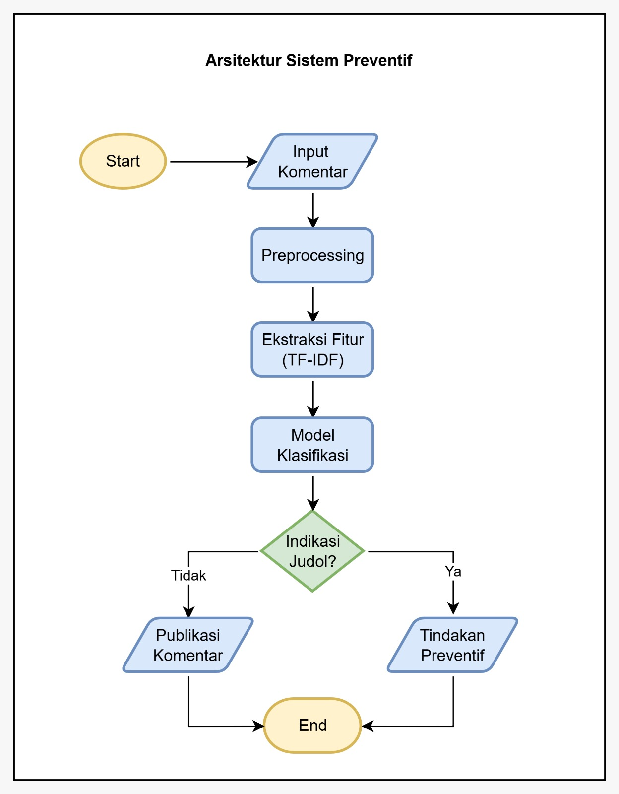

# Simulasi Sistem Moderasi Preventif - Judi Online Detection

Website simulasi sistem moderasi preventif untuk mendeteksi komentar promosi judi online pada platform YouTube menggunakan Model Machine Learning **SVM Classifier**.

## Daftar Isi

- [Fitur](#fitur)
- [Arsitektur Sistem](#arsitektur-sistem)
- [Instalasi](#instalasi)
- [Cara Penggunaan](#cara-penggunaan)
- [Komponen Sistem](#komponen-sistem)
- [Pipeline Preprocessing](#pipeline-preprocessing)
- [Decision Engine](#decision-engine)

## Fitur

- **Real-time Comment Analysis**: Analisis komentar secara real-time
- **Multi-stage Preprocessing**: Normalisasi unicode, obfuscation removal, URL normalization
- **TF-IDF Vectorization**: Konversi teks menjadi representasi numerik
- **SVM Classification**: Model SVM Classifier untuk prediksi
- **Decision Engine**: Sistem keputusan berbasis threshold probabilitas

## Arsitektur Sistem
 

## Instalasi

### Prasyarat
- Python 3.8+
- pip (Python package manager)

### Step 1: Persiapan Environment

```bash
# Masuk ke folder project
cd web_simulasi

# Buat virtual environment (opsional tapi recommended)
python -m venv venv

# Activate virtual environment
# Untuk Windows:
venv\Scripts\activate
# Untuk Linux/Mac:
source venv/bin/activate
```

### Step 2: Install Dependencies

```bash
pip install -r requirements.txt
```

### Step 3: Menyimpan Model

Sebelum menjalankan aplikasi, Anda perlu menyimpan model SVM dan TF-IDF vectorizer:

```bash
# Jalankan script untuk save model
python save_model.py
```

**Catatan**: Script ini akan membaca file `dataset/dataset_judol_clean.csv` dari folder parent dan menyimpan model di folder `models/`.

**Output yang diharapkan**:
```
Loading dataset...
Dataset shape: (xxx, 4)
Training set: (xxx, 1)
Test set: (xxx, 1)

Creating TF-IDF vectorizer...
TF-IDF shape: (xxx, 5000)

Training SVM Classifier Model...
Training Score: 0.xxxx
Test Score: 0.xxxx

Saving model and vectorizer...
✓ Model saved: models/svm_model.pkl
✓ Vectorizer saved: models/tfidf_vectorizer.pkl
✓ Preprocessing dict saved: models/preprocessing_dict.pkl

✓ All models saved successfully!
```

## Cara Penggunaan

### Menjalankan Aplikasi

```bash
# Jalankan Flask app
python app.py
```

Aplikasi akan berjalan di `http://localhost:5000`

### Menggunakan Interface Web

1. **Buka Browser**: Navigasi ke `http://localhost:5000`
2. **Input Komentar**: Masukkan komentar di textarea
3. **Klik "Analisis Komentar"**: Submit untuk analisis
4. **Lihat Hasil**: Sistem akan menampilkan:
   - Prediksi klasifikasi
   - Probabilitas (Non-Judi vs Judi)
   - Decision (Publikasi Normal / Blokir Otomatis)
   - Teks setelah preprocessing

## Komponen Sistem

### 1. **Backend (Flask)**

**File**: `app.py`

- Load model SVM dan TF-IDF vectorizer
- Implement preprocessing pipeline
- API endpoint `/api/predict` untuk prediksi
- Decision engine dengan threshold 50%
- Error handling dan validation

**API Endpoints**:

- `GET /`: Halaman utama (HTML)
- `POST /api/predict`: Submit komentar untuk analisis
  - Request: `{"comment": "teks komentar"}`
  - Response: Prediction results + decision
- `GET /api/info`: Informasi sistem

### 2. **Frontend (HTML/CSS/JS)**

**File**: `templates/index.html`

- Beautiful UI dengan Tailwind CSS
- Real-time character counter
- Input validation
- Visualization of probabilities
- Display decision dan action
- Example comments untuk testing

### 3. **Model Training & Saving**

**File**: `save_model.py`

- Load dataset bersih dari CSV
- Split data (80% train, 20% test)
- Create TF-IDF vectorizer
- Train SVM model
- Save model dan vectorizer ke pickle files

## Pipeline Preprocessing

### 1. Unicode Normalization (NFKD dan NFKC)
Mengubah karakter unicode yang tidak standard menjadi bentuk canonical.

**Contoh**:
```
Input: "café" (dengan kombinasi characters)
Output: "cafe" (normalized)
```

### 2. Obfuscation Character Replacement
Mengganti karakter yang sengaja diubah untuk menghindari deteksi.

**Contoh Obfuscation Characters**:
- 🅿️ → "p" (Judi → Jud i → J ud i)
- 🅻 → "l"
- ⓤ → "u"
- 4️⃣ → "4"
- @ → "a"

**Contoh**:
```
Input: "🅿️🅻 jaminan jackpot"
Output: "pl jaminan jackpot"
```

### 3. URL Normalization
Mengganti semua URL dengan placeholder "iniurl".

**Contoh**:
```
Input: "join sekarang di https://example.com/judi"
Output: "join sekarang di iniurl"
```

### 4. Text Cleaning
- Lowercase semua teks
- Hapus karakter special (keep hanya alphanumeric + space)
- Hapus spasi berlebih

**Contoh**:
```
Input: "Join!!!  SEKARANG @@ Link #$%"
Output: "join sekarang link"
```

## Decision Engine

### Threshold-based Decision System

```
IF probability_judi > 0.50:
    decision = "BLOKIR OTOMATIS"
    action = "Komentar disembunyikan dan tidak akan dipublikasikan"
    severity = "high"
ELSE:
    decision = "PUBLIKASI NORMAL"
    action = "Komentar akan dipublikasikan normalmente"
    severity = "low"
```

### Interpretation

| Probability Range | Decision | Tindakan |
|---|---|---|
| 0 - 50% | PUBLIKASI NORMAL | ✓ Komentar dipublikasikan |
| 50% - 100% | BLOKIR OTOMATIS | ✗ Komentar disembunyikan |

## License

Proyek ini merupakan bagian dari skripsi untuk klasifikasi komentar judi online. Lihat [LICENSE](../LICENSE) untuk detail lisensi.